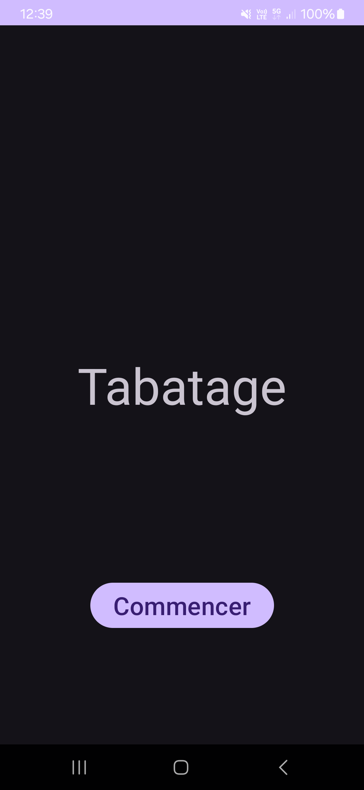
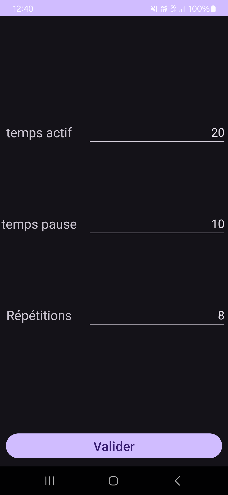
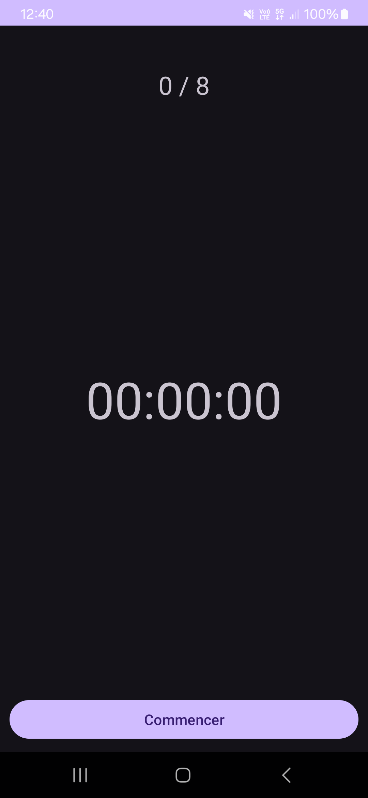
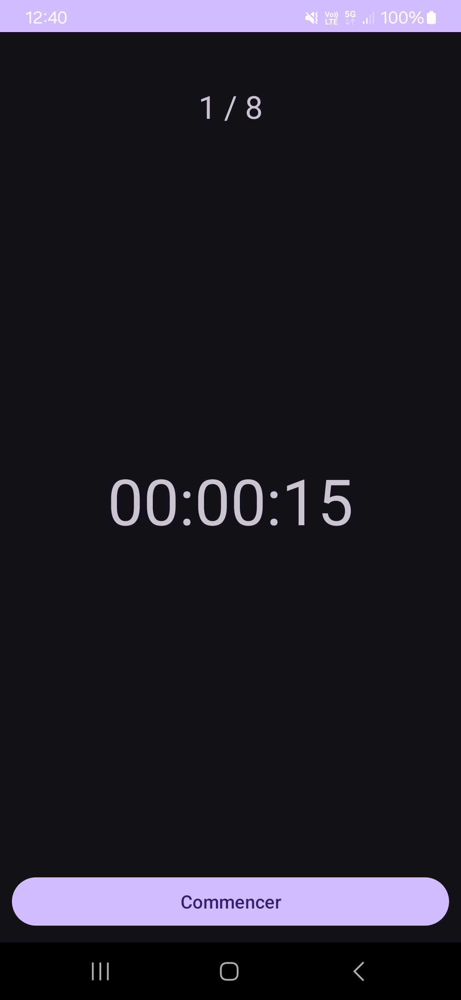

# Tabatage

## Présentation
Tabatage est une application mobile qui permet de réaliser des tabatas (exercice de sport qui consiste à fractionner son temps d'action mais en rendant l'exercice plus intense). Cette application a été réalisé sur android studio et en java.

## Interface
Le jeux est composé de trois écrans :
- un écran d'accueil 

- un écran pour choisir le type de tabata

- un écran pour faire le tabata

## Fonctionnalités
- Choisir le type de tabata en fonction de 3 paramètres :
    - le temps en action
    - le temps de repos
    - le nombre de séries
- lancer 1 fois le tabata